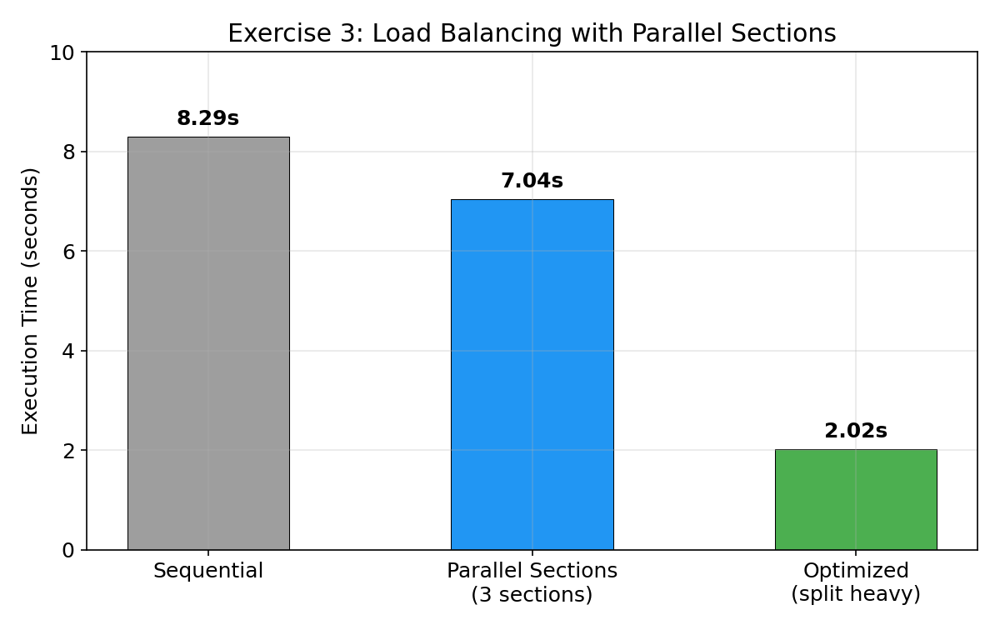
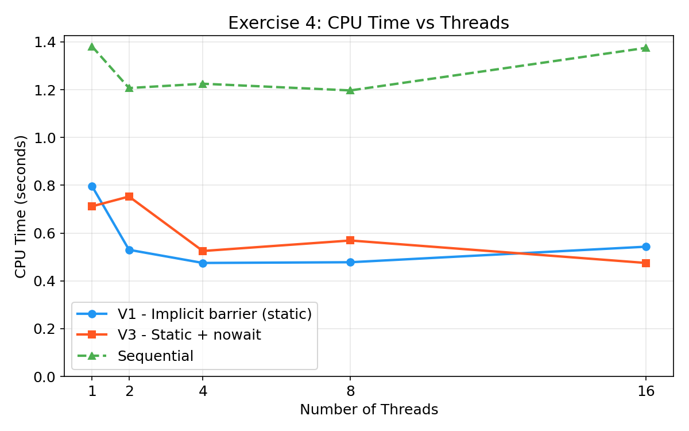
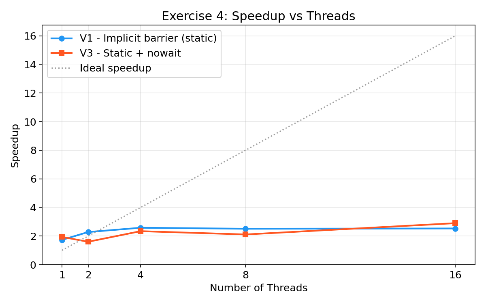
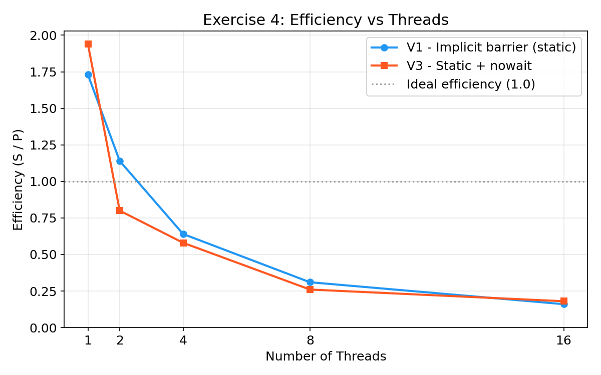
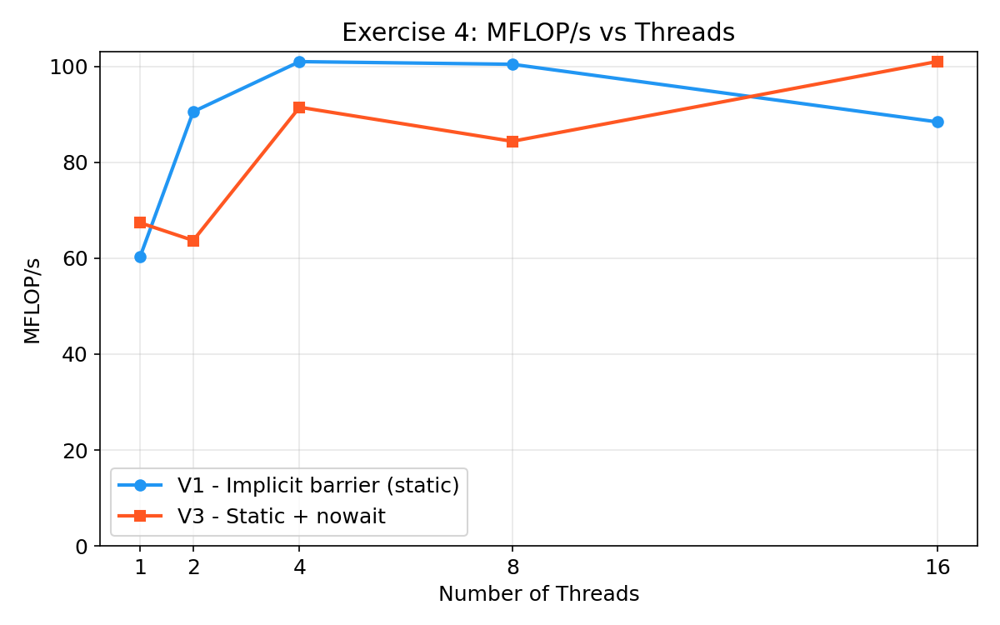

# TP4 - OpenMP (Sections & Synchronization) 

---

## Exercise 1: Work Distribution with Parallel Sections

### Objective
- Initialize an array of size N with random values.
- Use `#pragma omp sections` to divide the work into 3 sections:
  - **Section 1**: Compute the sum of all elements.
  - **Section 2**: Compute the maximum value.
  - **Section 3**: Compute the standard deviation (**using the sum from Section 1**, without recomputing it).
- Ensure all computations run in parallel.

### The Dependency Problem

Section 3 (standard deviation) requires the mean, which depends on the sum computed by Section 1. Since all three sections run concurrently, **Section 3 must wait for Section 1 to finish**.

**Solution**: Use a `volatile int sum_done` flag:
- Section 1 sets `sum_done = 1` after computing the sum.
- Section 3 busy-waits with `while (!sum_done)` before using the sum.

```c
volatile int sum_done = 0;

#pragma omp parallel sections
{
    #pragma omp section
    {
        // Section 1: Compute sum
        for (int i = 0; i < N; i++)
            par_sum += A[i];
        sum_done = 1;  // Signal completion
    }

    #pragma omp section
    {
        // Section 2: Compute max (independent)
        ...
    }

    #pragma omp section
    {
        // Section 3: Compute stddev (depends on sum)
        while (!sum_done) { /* spin-wait */ }
        par_mean = par_sum / N;
        for (int i = 0; i < N; i++)
            par_stddev += (A[i] - par_mean) * (A[i] - par_mean);
        par_stddev = sqrt(par_stddev / N);
    }
}
```

### Results (N = 1,000,000, 8 threads)

| Version | Sum | Max | Std Dev | Time (s) |
|---|---|---|---|---|
| Sequential | 499907.929319 | 1.000000 | 0.288695 | 0.050 |
| OpenMP Sections | 499907.929319 | 1.000000 | 0.288695 | 0.048 |

Thread assignment:
- Section 1 (sum) → thread 1
- Section 2 (max) → thread 2
- Section 3 (stddev) → thread 5

### Analysis

- **Correctness**: All three results match between sequential and parallel versions (verified programmatically).
- **Performance**: The parallel version is only marginally faster because:
  - `sections` creates at most 3 parallel tasks (3 threads used out of 8).
  - **Section 3 is serialized** after Section 1 due to the dependency — it cannot start its main work until Section 1 finishes.
  - The effective parallelism is limited: Section 2 (max) runs in parallel with Section 1 (sum), but Section 3 (stddev) is mostly sequential after Section 1.
- **Busy-waiting trade-off**: The `while (!sum_done)` spin-wait burns CPU cycles. For very fast Section 1 completions this is negligible, but for longer waits it wastes resources. An alternative would be splitting the work into two consecutive `parallel sections` blocks (first block: sum + max, second block: stddev).

### Key Takeaway

> When sections have **data dependencies**, the dependent section is effectively serialized. The `volatile` flag approach works but limits parallelism. For better performance, consider restructuring into sequential phases of independent parallel work.

---

## Exercise 2: Exclusive Execution — Master vs Single

### Objective
- A **master** thread initializes a matrix.
- A **single** thread prints the matrix.
- **All threads** compute the sum of elements in parallel.
- Compare execution time with and without OpenMP.

### OpenMP Directives Used
| Directive | Purpose |
|---|---|
| `#pragma omp master` | Only the master thread (thread 0) executes the block. **No implicit barrier** at the end. |
| `#pragma omp single` | Only one thread executes the block. **Implicit barrier** at the end (all threads wait). |
| `#pragma omp barrier` | Explicit synchronization point — all threads must reach it before any can proceed. |
| `#pragma omp for reduction(+:sum)` | Distributes loop iterations across threads and safely accumulates `sum`. |

### Results (N = 1000, 8 threads)

| Version | Sum | Execution Time (s) |
|---|---|---|
| Sequential | 999000000.0 | 0.014 |
| OpenMP (master + single) | 999000000.0 | 0.015 |

### Analysis

- Both versions produce the **same correct result** (Sum = 999,000,000).
- The OpenMP version is slightly slower for this matrix size because:
  - **Thread creation overhead** dominates for small workloads.
  - The `master` and `single` blocks are inherently **sequential** — only one thread works while others wait.
  - The `barrier` adds synchronization cost.
- For larger matrix sizes (e.g., N = 5000+), the parallel reduction on the sum would show improvement since the O(N²) summation benefits from distribution across threads.

### Key Differences: `master` vs `single`

| Feature | `master` | `single` |
|---|---|---|
| Which thread executes | Always thread 0 | Any one thread (runtime decides) |
| Implicit barrier at end | **No** | **Yes** |
| Need explicit barrier after? | Yes, if other threads depend on the result | No (built-in) |

---

## Exercise 3: Load Balancing with Parallel Sections

### Objective
- Simulate three workloads of different sizes using `parallel sections`.
- Measure execution time and optimize workload distribution.

### Workload Characteristics

| Task | Loop Iterations | Relative Cost |
|---|---|---|
| Task A (light) | N | 1× |
| Task B (moderate) | 5N | 5× |
| Task C (heavy) | 20N | 20× |

Total sequential work = 26N iterations (with N = 1,000,000).

### Results

| Version | Time (s) | Speedup |
|---|---|---|
| Sequential | 8.29 | 1.00× |
| Parallel Sections (3 sections) | 7.04 | 1.18× |
| Optimized Sections (split heavy) | 2.02 | 4.10× |

### Analysis

**Why is the basic parallel sections version barely faster?**

With 3 sections mapped to 3 threads:
- Thread 1 finishes Task A (1×) quickly and **idles**.
- Thread 2 finishes Task B (5×) and **idles**.
- Thread 3 is stuck on Task C (20×) — the **bottleneck**.

The total time ≈ time of the heaviest task (Task C), so parallelism barely helps.

**How the optimized version works:**

We split the workload into 3 roughly equal sections (~6-10N each):

| Section | Work | Cost |
|---|---|---|
| Section 1: Task A + Task B | 1N + 5N = 6N | ~6× |
| Section 2: Task C first half | 10N | ~10× |
| Section 3: Task C second half | 10N | ~10× |

Now the maximum section cost is ~10N instead of 20N, achieving much better load balancing. The total time is roughly halved compared to the heavy task alone.

### Execution Time Comparison



### Key Takeaway

> **`parallel sections` assigns one section per thread. The total time equals the slowest section.** To maximize performance, balance the workload across sections so no single section dominates.

---

## Exercise 4: Synchronization and Barrier Cost

### Objective
- Implement dense matrix-vector multiplication (DMVM) in 3 versions.
- Measure CPU time, Speedup, Efficiency, and MFLOP/s.
- Explain barrier behavior and `nowait` risks.

### DMVM: $\text{lhs} = \text{mat} \times \text{rhs}$

Matrix dimensions: **600 × 40000** (m=600 rows, n=40000 columns)

FLOPs per run: $2 \times m \times n = 2 \times 600 \times 40000 = 48{,}000{,}000$

### Three Versions

| Version | Schedule | Barrier |
|---|---|---|
| V1 | `schedule(static)` | Implicit barrier (default) |
| V2 | `schedule(dynamic) nowait` | No barrier |
| V3 | `schedule(static) nowait` | No barrier |

### Results: V1 (Implicit Barrier) vs V3 (Static + Nowait)

#### CPU Time (seconds)

| Threads | Sequential | V1 (implicit barrier) | V3 (static + nowait) |
|---|---|---|---|
| 1 | 1.381 | 0.796 | 0.712 |
| 2 | 1.207 | 0.530 | 0.753 |
| 4 | 1.225 | 0.475 | 0.525 |
| 8 | 1.197 | 0.478 | 0.569 |
| 16 | 1.375 | 0.543 | 0.475 |

#### Speedup ($S = T_{seq} / T_{parallel}$)

| Threads | V1 Speedup | V3 Speedup |
|---|---|---|
| 1 | 1.73 | 1.94 |
| 2 | 2.28 | 1.60 |
| 4 | 2.58 | 2.34 |
| 8 | 2.51 | 2.11 |
| 16 | 2.53 | 2.90 |

#### Efficiency ($E = S / P$, where P = number of threads)

| Threads | V1 Efficiency | V3 Efficiency |
|---|---|---|
| 1 | 1.73 | 1.94 |
| 2 | 1.14 | 0.80 |
| 4 | 0.64 | 0.58 |
| 8 | 0.31 | 0.26 |
| 16 | 0.16 | 0.18 |

#### MFLOP/s ($= \frac{FLOPs}{T \times 10^6}$)

| Threads | Sequential | V1 MFLOP/s | V3 MFLOP/s |
|---|---|---|---|
| 1 | 34.76 | 60.29 | 67.40 |
| 2 | 39.77 | 90.57 | 63.71 |
| 4 | 39.18 | 101.01 | 91.50 |
| 8 | 40.09 | 100.46 | 84.39 |
| 16 | 34.90 | 88.43 | 101.05 |

### Full Comparison (all 3 versions at 8 threads)

| Version | Time (s) | Speedup | Efficiency | MFLOP/s |
|---|---|---|---|---|
| Sequential | 1.197 | 1.00 | 1.00 | 40.09 |
| V1 — Implicit barrier (static) | 0.478 | 2.51 | 0.31 | 100.46 |
| V2 — dynamic + nowait | 0.258 | 4.64 | 0.58 | 185.90 |
| V3 — static + nowait | 0.569 | 2.11 | 0.26 | 84.39 |

### Plots

#### CPU Time vs Threads (V1 vs V3)


#### Speedup vs Threads (V1 vs V3)


#### Efficiency vs Threads (V1 vs V3)


#### MFLOP/s vs Threads (V1 vs V3)


### Why Barriers Limit Scalability

1. **Forced synchronization**: At an implicit barrier, **all threads must wait** for the slowest thread to finish before any thread can continue. This creates idle time.

2. **Load imbalance amplification**: If one thread gets a slightly heavier chunk (due to cache effects, OS scheduling, NUMA), all other threads are blocked waiting.

3. **Overhead grows with thread count**: More threads → higher probability of stragglers → more time wasted at barriers. This is why efficiency drops significantly from 1.73 (1 thread) to 0.16 (16 threads).

4. **Amdahl's Law**: The barrier itself is a serial synchronization point. As thread count increases, this serial fraction becomes the dominant bottleneck.

### When `nowait` Becomes Dangerous

`nowait` removes the implicit barrier at the end of a worksharing construct, meaning threads proceed immediately without waiting for others to finish.

**Dangerous scenarios:**

1. **Data dependency**: If code after the loop **reads results** computed by the loop, some iterations may not have completed yet:
   ```c
   #pragma omp for nowait
   for (int i = 0; i < N; i++)
       A[i] = compute(i);
   
   // DANGER: A[i] may not be fully computed yet!
   total = sum(A, N);
   ```

2. **Write-after-write conflicts**: If a subsequent loop writes to the same array, threads that finished the first loop early may overwrite values that other threads still need.

3. **Reduction operations**: If a manual reduction follows the loop, `nowait` can cause threads to access partially accumulated values.

**When `nowait` is safe:**
- The parallel region ends immediately after the loop (the `}` of `#pragma omp parallel` provides its own barrier).
- No subsequent code depends on the loop's results within the same parallel region.
- Each iteration writes to independent memory locations and no other work follows.

---

## Summary

| Exercise | Key Concept | Main Finding |
|---|---|---|
| Ex2 | `master` vs `single` | `single` has implicit barrier, `master` does not. OpenMP overhead can outweigh benefits for small workloads. |
| Ex3 | `parallel sections` | Load balancing is critical — total time = slowest section. Splitting heavy tasks across sections yields 4× speedup. |
| Ex4 | Barriers & `nowait` | Barriers hurt scalability (efficiency drops from 1.73 to 0.16). `dynamic` scheduling helps with irregular loads. `nowait` improves performance but risks correctness. |
