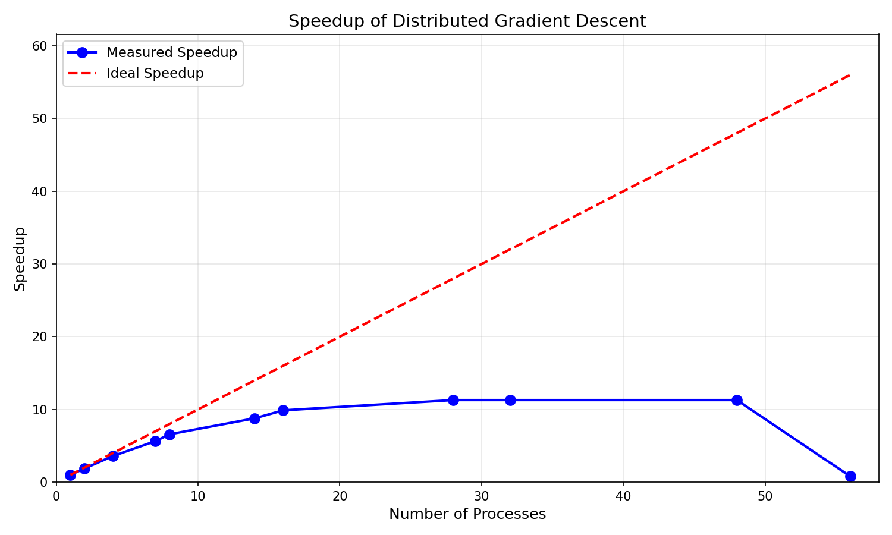
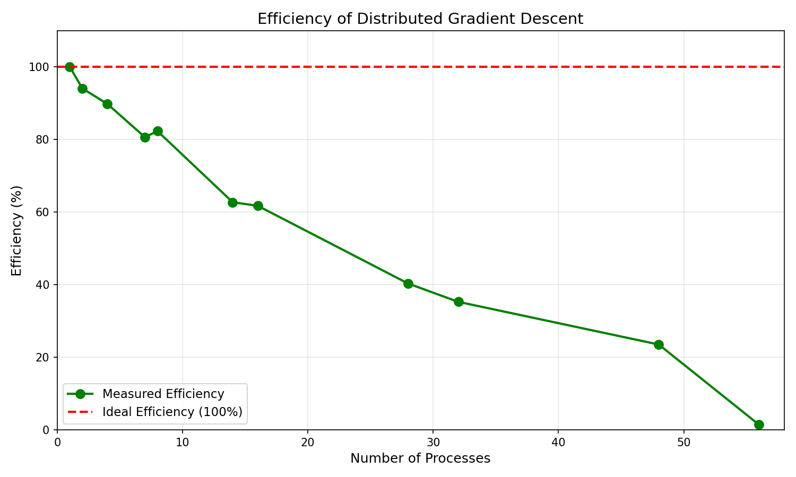

# TP6: MPI Derived Types


---

## Exercise 1: Matrix Transposition using Derived Types

### Objective

Transpose a 4×5 matrix during MPI communication using derived datatypes. Process 0 holds the original matrix A[4][5], and Process 1 receives the transposed matrix AT[5][4] directly in memory through a single MPI_Recv call.

### Approach

The solution uses two MPI derived datatypes:

1. **MPI_Type_vector**: Creates a strided pattern to scatter elements from one source row into one destination column. Parameters: count=5 (elements per row), blocklength=1, stride=4 (column spacing in destination).

2. **MPI_Type_create_hvector**: Replicates the vector type for all 4 source rows, with byte stride of sizeof(double) to place each row as a separate column in the destination.

Process 0 sends the matrix as 20 contiguous doubles. Process 1 receives using the derived type, which automatically places elements in transposed positions.

### Results

**Process 0 - Original Matrix a[4][5]:**
```
 1   2   3   4   5
 6   7   8   9  10
11  12  13  14  15
16  17  18  19  20
```

**Process 1 - Transposed Matrix at[5][4]:**
```
 1   6  11  16
 2   7  12  17
 3   8  13  18
 4   9  14  19
 5  10  15  20
```

The transposition is correct: each column of the original matrix becomes a row in the transposed matrix.

---

## Exercise 2: Distributed Gradient Descent with MPI Derived Types

### Objective

Implement distributed batch gradient descent using MPI. The Sample structure (feature vector + label) requires a custom MPI datatype created with MPI_Type_create_struct.

### Approach

The implementation follows these steps:

1. **Derived Type Creation**: MPI_Type_create_struct defines the Sample datatype with two blocks: N_FEATURES doubles for the feature vector and 1 double for the label. Displacements are computed using MPI_Get_address to handle potential compiler padding.

2. **Data Distribution**: Process 0 generates the full dataset and distributes it using MPI_Scatterv with the custom datatype.

3. **Gradient Computation**: Each process computes local predictions, errors, MSE loss, and gradients for its subset of samples.

4. **Global Aggregation**: MPI_Allreduce sums gradients and losses across all processes. This function combines reduction and broadcast, ensuring all processes have identical values for synchronous weight updates.

5. **Weight Update**: All processes apply the same gradient descent update: w = w - learning_rate × gradient / N_SAMPLES.

6. **Early Stopping**: Training terminates when MSE falls below 0.01.

### Results: Single Run (4 processes, 1000 samples)

Training converged after 402 epochs with early stopping.

| Metric | Value |
|--------|-------|
| Initial weights | w[0]=0, w[1]=0 |
| Final weights | w[0]=1.8792, w[1]=-0.9419 |
| True weights | w[0]=2.0, w[1]=-1.0 |
| Final MSE | 0.009911 |
| Training time | 0.002 seconds |

The learned weights approximate the true weights with less than 7% error, demonstrating successful convergence.

### Results: Scaling Experiment (100,000 samples, Toubkal cluster)

| Processes | Time (s) | Speedup | Efficiency |
|-----------|----------|---------|------------|
| 1 | 0.079 | 1.00× | 100.0% |
| 2 | 0.042 | 1.88× | 94.0% |
| 4 | 0.022 | 3.59× | 89.8% |
| 7 | 0.014 | 5.64× | 80.6% |
| 8 | 0.012 | 6.58× | 82.3% |
| 14 | 0.009 | 8.78× | 62.7% |
| 16 | 0.008 | 9.88× | 61.7% |
| 28 | 0.007 | 11.29× | 40.3% |
| 32 | 0.007 | 11.29× | 35.3% |
| 48 | 0.007 | 11.29× | 23.5% |
| 56 | 0.099 | 0.80× | 1.4% |

**Maximum speedup achieved: 11.29× with 28-48 processes**

### Speedup Plot



The speedup curve shows near-linear scaling up to 8 processes, then sublinear growth until plateauing at 28 processes. The 56-process case shows negative scaling.

### Efficiency Plot



Efficiency decreases steadily as process count increases, from 94% at 2 processes to 23.5% at 48 processes.

### Analysis

**Good scaling region (1-16 processes):** Efficiency remains above 60%. Communication overhead is small relative to computation.

**Plateau region (28-48 processes):** Execution time floors at 0.007 seconds. Additional processes provide no benefit because:
- The problem size (100K samples) is too small to keep all cores busy
- MPI_Allreduce communication latency dominates
- Amdahl's law limits speedup due to serial portions (data generation, I/O)

**Performance degradation (56 processes):** Time increases to 0.099 seconds (slower than single-process). This anomaly occurs because 56 processes exceed a single node, introducing inter-node communication over the network fabric. The high latency of cross-node MPI_Allreduce operations outweighs any computational gains.

